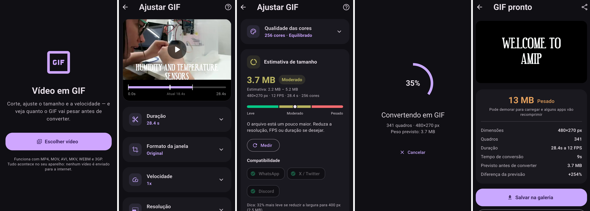

<div align="center">


# Vídeo em GIF

**Conversor de vídeo para GIF em Flutter, com estimativa de peso antes da conversão**


</div>

Aplicativo Android que converte vídeos comuns (MP4, MOV, AVI, MKV, WEBM, 3GP)
em GIF, com controle de corte, proporção, velocidade, resolução e quadros por
segundo — e, principalmente, **mostrando quanto o arquivo vai pesar antes de
gastar tempo convertendo**.




`Toda a conversão roda no aparelho, com FFmpeg. O app não tem permissão de
internet.`

---

## O problema que ele resolve

Converter vídeo em GIF é lento, e o peso do resultado é imprevisível: o mesmo
ajuste que produz 800 KB num vídeo produz 14 MB em outro, porque depende de
quanto a cena se mexe. O caminho normal é converter, ver que ficou grande,
ajustar e converter de novo — vários minutos por tentativa.

Este app inverte isso:

1. **Estimativa instantânea** enquanto você mexe nos controles, sem converter
   nada.
2. **Botão "Medir"**, que converte trechos de menos de um segundo e usa o
   resultado real para calibrar o número — depois disso a previsão fica
   dentro de ±15%.
3. **Semáforo de destinos**: mostra se o GIF cabe no WhatsApp, no X/Twitter,
   no Discord. Se não couber, um toque ajusta as configurações para caber.

Como isso funciona por dentro está em
[`docs/COMO_A_ESTIMATIVA_FUNCIONA.md`](docs/COMO_A_ESTIMATIVA_FUNCIONA.md).

## Funcionalidades

- **Corte de duração** — arraste as pontas para escolher o trecho
- **Formato da janela** — original, 1:1, 4:5, 9:16, 16:9, 4:3, 3:2, com
  posição ajustável do recorte
- **Velocidade** — de 0,25x (câmera lenta) a 4x
- **Resolução** — de 160 px a 1080 px de largura, sem ampliar o original
- **Quadros por segundo** — de 5 a 30
- **Qualidade de cor** — tamanho da paleta, tipo de suavização (dither) e
  estratégia de paleta
- **Conversão em duas passagens** (`palettegen` + `paletteuse`), que é o que
  separa um GIF bonito de um GIF "lavado"
- **Progresso com cancelamento**
- **Salvar na galeria e compartilhar**

## Como rodar

Requer Flutter 3.44+ e o Android SDK (API 36) com NDK instalados.

```bash
git clone https://github.com/lianeheidemann/aplicativo-video-to-gif-1.git
cd aplicativo-video-to-gif-1

flutter pub get
flutter test
flutter run
```

Para gerar o pacote da loja:

```bash
flutter build appbundle --release
```

> O `gradlew` e o `local.properties` não são versionados (convenção do
> Flutter) — a própria ferramenta os recria no primeiro build. Se der erro de
> NDK, ajuste `ndkVersion` em `android/app/build.gradle.kts` para a versão
> que você tem instalada; a mensagem de erro informa qual é.

## Publicar na Play Store

O passo a passo completo, incluindo a exigência de teste fechado com 12
pessoas por 14 dias, está em
**[`docs/PUBLICAR_NA_PLAY_STORE.md`](docs/PUBLICAR_NA_PLAY_STORE.md)**.

Resumo do caminho: conta de desenvolvedor (US$ 25, uma vez) → chave de
assinatura → AAB de release → ficha da loja → teste fechado de 14 dias →
pedido de acesso à produção → publicação. **De 3 a 5 semanas no total**, com
o teste fechado sendo o gargalo.

Documentos de apoio:

- [`docs/LICENCAS.md`](docs/LICENCAS.md) — por que este projeto usa a
  variante LGPL do FFmpeg e o que isso exige de você
- [`docs/POLITICA_DE_PRIVACIDADE.md`](docs/POLITICA_DE_PRIVACIDADE.md) —
  modelo pronto para publicar (a Play Store exige a URL)

## Estrutura

```
lib/
├── main.dart                       # ponto de entrada
├── licenses.dart                   # aviso de licença do FFmpeg (LGPL)
├── theme.dart
├── models/
│   ├── video_info.dart             # metadados lidos pelo FFprobe
│   ├── conversion_settings.dart    # tudo que o usuário controla
│   └── size_estimate.dart          # resultado da estimativa e classificação
├── services/
│   ├── size_estimator.dart         # o modelo de previsão de peso (Dart puro)
│   ├── ffmpeg_service.dart         # leitura, medição e conversão
│   └── output_service.dart         # galeria e compartilhamento
└── ui/
    ├── home_page.dart
    ├── editor_page.dart            # controles + painel de estimativa
    ├── converting_page.dart
    ├── result_page.dart
    └── widgets/

test/
├── size_estimator_test.dart        # 29 testes do modelo de estimativa
└── size_panel_test.dart            # 9 testes do painel de peso

loja/                               # material pronto da ficha da Play Store
├── FICHA_DA_LOJA.md                # textos dentro dos limites de caracteres
├── icone_512.png
└── grafico_destaque_1024x500.png

tool/
└── gerar_icones.py                 # gera ícone, adaptativo e imagens da loja
```

O `size_estimator.dart` é Dart puro, sem dependência do Flutter nem do
FFmpeg — por isso dá para testá-lo inteiro sem emulador.

## Qualidade

`flutter analyze` limpo e **38 testes** passando. O workflow em
`.github/workflows/ci.yml` roda formatação, análise, testes e um build do APK
de debug a cada push — esse último serve para pegar erro de Gradle, de fusão
de manifesto e de empacotamento das bibliotecas nativas do FFmpeg.

## Baixar o APK

Cada versão publicada vira um
[Release](https://github.com/lianeheidemann/aplicativo-video-to-gif-1/releases)
com os APKs prontos para instalar — comece pelo `arm64-v8a`, que serve para
praticamente todo celular Android atual.

Para gerar uma versão nova:

```bash
git tag v1.0.0
git push origin v1.0.0
```

O workflow `.github/workflows/release.yml` compila, nomeia e publica os
arquivos sozinho. Configurando os segredos do keystore no repositório, ele
também gera o `.aab` assinado que vai para a Play Console — o passo a passo
está na [Etapa 5b do guia de publicação](docs/PUBLICAR_NA_PLAY_STORE.md).

## Stack

| Camada | Escolha | Por quê |
|---|---|---|
| Interface | Flutter 3.44 (Material 3) | um código, e a Play Store aceita direto |
| Conversão | `ffmpeg_kit_flutter_new_min` (FFmpeg LGPL) | variante sem componentes GPL, permite app de código fechado |
| Escolha de arquivo | `file_picker` | usa o seletor do sistema, sem exigir permissão de mídia |
| Saída | `gal` + `share_plus` | salvar na galeria e compartilhar |

## Licença

Código do aplicativo: MIT.
FFmpeg: LGPL-2.1-or-later — veja [`docs/LICENCAS.md`](docs/LICENCAS.md).
